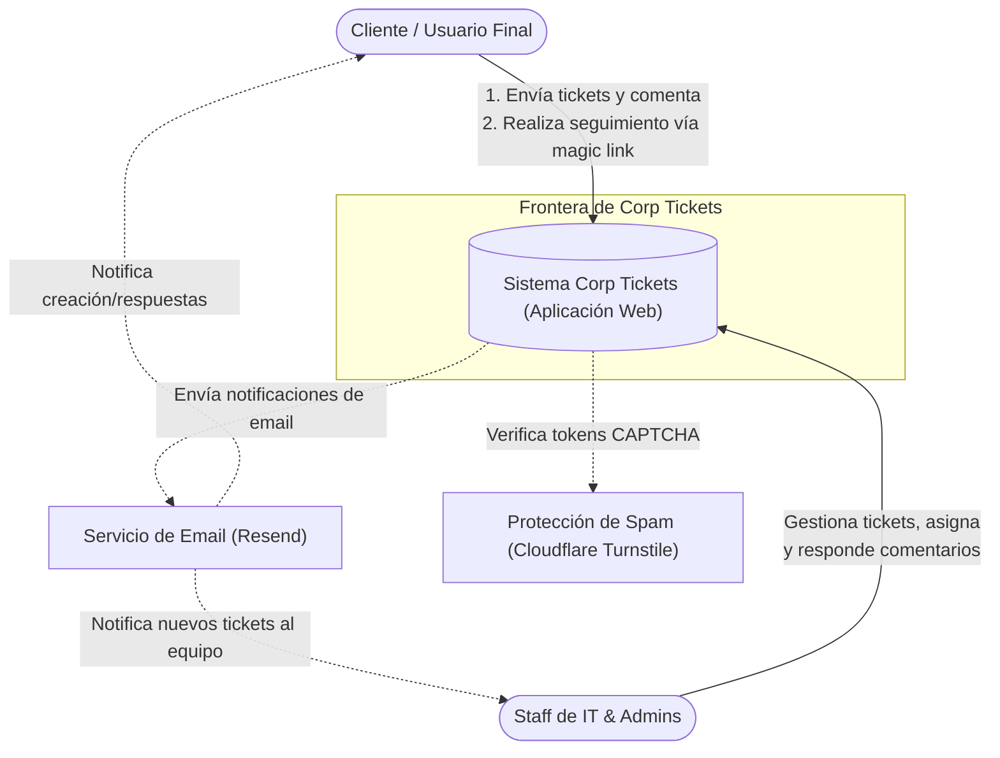
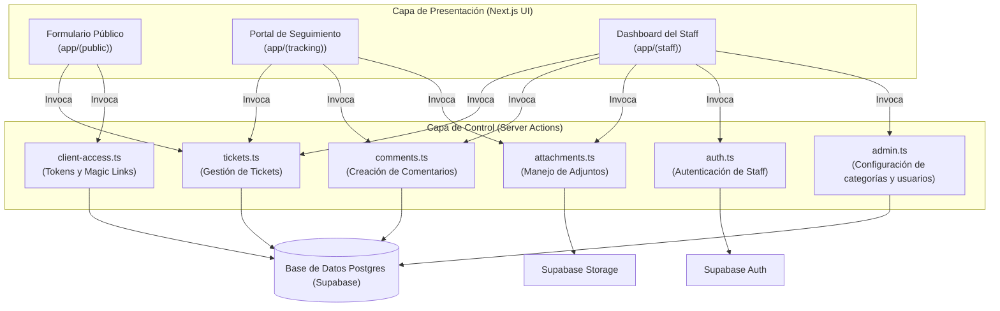
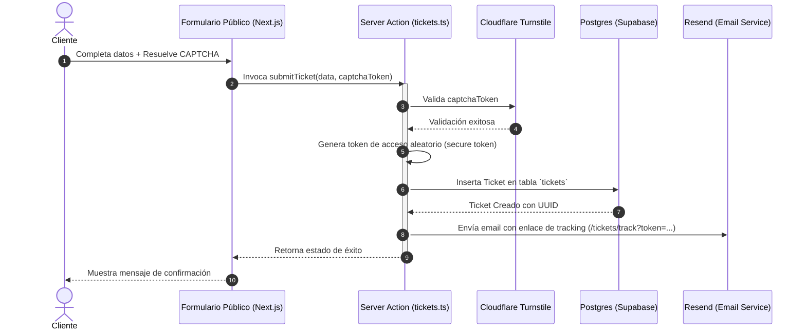
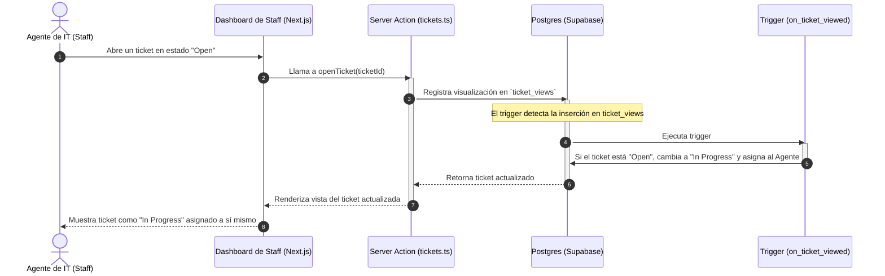
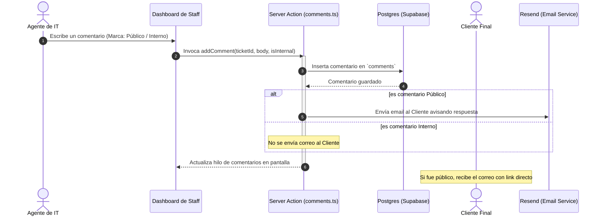

# Arquitectura del Sistema y Flujos de Procesos — Corp Tickets

Este documento proporciona una especificación detallada de la arquitectura del sistema **Corp Tickets** y describe los procesos clave, decisiones de diseño y mecanismos de seguridad implementados a nivel de sistema, contenedor y componentes.

---

## 1. Modelo de Arquitectura C4

### Nivel 1: Contexto de Sistema

El sistema permite a los **Clientes** enviar solicitudes de soporte y realizar el seguimiento de las mismas, mientras que el **Staff de IT y Administradores** gestionan las colas de tickets.



### Nivel 2: Contenedores

El sistema se compone de una aplicación web construida con **Next.js** y un backend gestionado a través de **Supabase**, utilizando servicios integrados para Base de datos, Autenticación y Almacenamiento.

```mermaid
flowchart TB
    Client([Cliente / Usuario Final])
    Staff([Staff de IT & Admins])

    subgraph NextJS ["Contenedor: Next.js App Router (Node.js/Vercel)"]
        Frontend["Frontend (React UI)"]
        ServerActions["Backend (Server Actions & Route Handlers)"]
    end

    subgraph Supabase ["Contenedor: Supabase Backend (Managed Postgres)"]
        DB[(Base de datos PostgreSQL)]
        AuthService["Supabase Auth"]
        Storage["Supabase Storage (Adjuntos)"]
    end

    Resend["Servicio de Email (Resend)"]
    Turnstile["Cloudflare Turnstile"]

    %% Interacciones
    Client -->|Interactúa con la UI| Frontend
    Staff -->|Navega, se autentica y gestiona| Frontend
    Frontend -->|Invoca funciones seguras| ServerActions

    ServerActions -->|Consulta y persiste datos| DB
    ServerActions -->|Maneja sesiones y roles| AuthService
    ServerActions -->|Sube/Descarga archivos adjuntos| Storage
    ServerActions -.->|Envía correos electrónicos| Resend
    ServerActions -.->|Valida tokens de protección| Turnstile

    Frontend -.->|Escucha cambios en tiempo real\n(Ticket Queue Realtime)| DB
    Frontend -.->|Autenticación directa en cliente| AuthService
```

### Nivel 3: Componentes (Next.js & Supabase)

Desglose interno de las capas de software del frontend y el servidor de base de datos.



---

## 2. Procesos y Flujos Detallados

A continuación se detallan los tres procesos fundamentales del sistema.

### A. Flujo de Envío de Ticket y Generación de Magic Link

Este proceso permite a un cliente externo enviar un ticket de soporte sin necesidad de crear una cuenta tradicional en la plataforma.



**Puntos clave del flujo:**

- **Seguridad (Anti-Spam):** La validación con Cloudflare Turnstile ocurre en el lado del servidor de forma síncrona antes de escribir en la base de datos.
- **Acceso sin Contraseña:** El token aleatorio generado se almacena en la tabla de tickets y actúa como una clave de un solo ticket para el cliente.

---

### B. Flujo de Ciclo de Vida del Ticket y Asignación Automática

El ciclo de vida del ticket está automatizado en base a las acciones que realiza el staff de soporte técnico.



**Reglas de negocio críticas:**

- **Auto-asignación:** Diseñada para evitar colisiones entre agentes de soporte. Al ver un ticket no asignado, el sistema asume que el agente se encargará de resolverlo.
- **Estados del Ticket:**
  - `Open`: Estado por defecto al ser creado.
  - `In Progress`: Al ser abierto por primera vez por un agente de IT.
  - `Resolved`: Marcado manualmente por el staff de IT tras solucionar la petición.
  - `Closed`: Marcado manualmente por el staff si no procede (requiere registrar un motivo de cierre).

---

### C. Flujo de Comentarios y Notificaciones (Colaboración)

Permite la comunicación entre el staff y el cliente en un formato de conversación segura.



**Diferenciación de accesos en Comentarios:**

- **Comentarios Públicos:** Visibles tanto para el staff como para el cliente desde su portal de tracking.
- **Comentarios Internos (Private Notes):** Solo visibles para miembros de IT y Administradores. Nunca se exponen al cliente ni se envían por email.

---

## 3. Seguridad de Datos e Infraestructura (Capa Postgres)

Una parte sustancial de la arquitectura de la aplicación descansa en las garantías de seguridad de la base de datos Supabase, la cual utiliza **Políticas de Seguridad a Nivel de Fila (RLS)** y **Triggers**.

### Row Level Security (RLS)

La base de datos restringe quién puede leer y escribir en cada fila utilizando el rol del token JWT del usuario o el token mágico en las cabeceras.

1. **Tabla `tickets`**:
   - **Staff/Admins:** Tienen permiso de lectura y actualización sobre todos los registros.
   - **Clientes:** Tienen permiso de lectura y actualización limitado únicamente si el token de acceso provisto en la consulta coincide con la columna `access_token` del ticket.
2. **Tabla `comments`**:
   - **Staff/Admins:** Pueden leer todos los comentarios y crear comentarios de tipo `Public` o `Internal`.
   - **Clientes:** Solo pueden leer comentarios donde `is_internal = false` asociados a su ticket. Solo pueden insertar comentarios marcados obligatoriamente como `is_internal = false`.
3. **Tabla `attachments`**:
   - Los clientes solo pueden subir o ver archivos si están autorizados por su token de ticket.

### Triggers y Automatizaciones

- **Sincronización de Perfiles:** Un trigger en la tabla de autenticación de Supabase (`auth.users`) propaga automáticamente los nuevos usuarios de staff creados a la tabla pública `profiles` con su respectivo rol de aplicación (`IT` o `Admin`).
- **Seguimiento de Vistas (`ticket_views`):** Un trigger auditor en la inserción de vistas de tickets muta el estado del ticket y su asignación, garantizando que esta acción no pueda ser evitada desde la interfaz de usuario.
