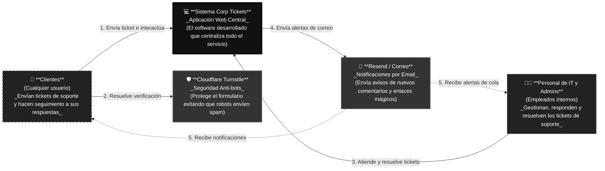
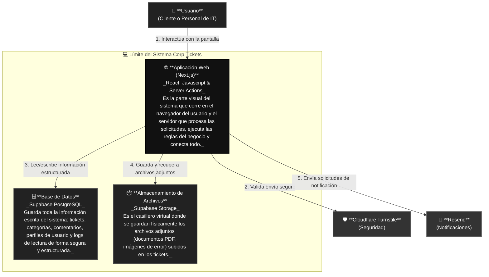
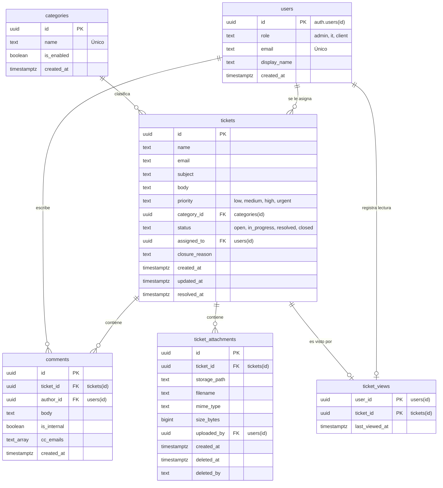

# Arquitectura del Sistema — Corp Tickets

Este documento describe la arquitectura de **Corp Tickets**, un sistema minimalista de gestión de tickets de soporte técnico. Está diseñado para ser comprensible tanto para personas sin perfil técnico como para desarrolladores que deseen entender el funcionamiento del sistema a alto nivel.

Para lograr esto, la documentación está dividida en niveles inspirados en el **Modelo C4** de arquitectura de software, enfocándose principalmente en el contexto general y los componentes principales del sistema.

---

## Capa 1: Contexto del Sistema (¿Quién usa el sistema y con qué interactúa?)

Esta capa representa la vista de más alto nivel. Imagina que el sistema es una "caja negra" y queremos ver cómo se relaciona con las personas y otros servicios externos.

### Explicación Sencilla de los Actores:

- **Clientes:** Son usuarios (internos de la empresa o clientes externos) que experimentan un problema técnico. Pueden crear un ticket de soporte de forma pública sin tener una cuenta previa y realizar el seguimiento mediante un enlace seguro enviado a su correo.
- **Personal de IT y Administradores:** Son los miembros del equipo que resuelven los incidentes. Tienen un panel privado donde ven todos los tickets, los asignan, agregan comentarios públicos o notas internas, y configuran las categorías de atención.
- **Cloudflare Turnstile:** Es un guardián silencioso. Cuando alguien envía un ticket público, Turnstile verifica en segundos que sea un humano y no un script automatizado dañino.
- **Resend:** Es el encargado del correo. Cada vez que pasa algo importante (se crea un ticket, se responde o se cierra), este servicio se asegura de que le llegue la notificación por correo al cliente o al personal de IT asignado.

---

## Capa 2: Contenedores (¿De qué partes está hecho el sistema?)

Si abrimos la "caja negra" del **Sistema Corp Tickets**, nos encontramos con los contenedores. Un contenedor es una parte del software que ejecuta código o almacena información.

### Detalle de los Contenedores:

1.  **Aplicación Web (Next.js):**
    - _¿Qué hace?_ Renderiza las páginas que los usuarios ven en su pantalla (el formulario público, el dashboard de IT, etc.). También actúa como el servidor de aplicación, encargándose de recibir datos, validar formularios (con la librería `zod`), y procesar los cambios de estado del ticket de forma segura.
    - _Tecnología:_ Next.js App Router (Javascript/TypeScript).
2.  **Base de Datos (Supabase PostgreSQL):**
    - _¿Qué hace?_ Es el cerebro del almacenamiento. Guarda la información en tablas estructuradas y relacionadas entre sí (quién creó el ticket, qué comentarios tiene, qué agente de IT está asignado).
    - _Seguridad Clave (RLS):_ Cuenta con **Row Level Security (RLS)**, lo que significa que la propia base de datos impide que un cliente chismoso intente leer los tickets de otra persona, incluso si la aplicación web tuviera un error de programación.
3.  **Almacenamiento de Archivos (Supabase Storage):**
    - _¿Qué hace?_ Las bases de datos no son buenas guardando archivos grandes como imágenes o PDFs de 10 MB. Para eso existe este contenedor: un disco duro virtual optimizado para servir archivos adjuntos rápidamente.

---

## Detalles de Implementación Técnica (Para Desarrolladores)

Si eres programador y necesitas saber exactamente cómo se implementa esto en el código, aquí tienes las capas de bajo nivel:

### 1. Organización del Enrutamiento (Route Groups en Next.js)

El frontend organiza las pantallas mediante grupos de rutas que encapsulan la lógica de acceso:

- `app/(public)/`: Páginas de acceso libre (formulario de creación de tickets).
- `app/(public-access)/`: Páginas para iniciar sesión de clientes o solicitar accesos de seguimiento.
- `app/(tracking)/`: Panel de seguimiento del cliente (`/track` y `/track/[ticketId]`). Si un usuario sin sesión intenta entrar, es redirigido mediante lógica del servidor a `/portal`.
- `app/(staff)/`: Panel privado del personal técnico e IT (`/dashboard` y `/admin`). Requiere autenticación y que el rol del usuario sea `admin` o `it`.

### 2. Modelo de Datos (Diagrama Entidad-Relación)

A nivel de base de datos PostgreSQL, la estructura está normalizada de la siguiente manera:

### 3. Flujo de Control de Acceso (RLS)

La autorización se valida en dos capas:

1.  **Capa Web (Next.js):** El archivo `proxy.ts` (en la raíz) y los layouts correspondientes interceptan las peticiones para verificar si el usuario tiene una sesión activa y redirigir si no está autorizado.
2.  **Capa Base de Datos (Supabase RLS):** Aunque alguien intente consultar la base de datos de manera directa omitiendo la aplicación web, PostgreSQL rechaza la petición si el rol del usuario decodificado en el JWT no tiene permisos. Por ejemplo:
    - Los clientes solo pueden consultar tickets donde el campo `email` coincida con su token de sesión (`auth.jwt() ->> 'email'`).
    - Los comentarios marcados como `is_internal = true` no se exponen a clientes a nivel de base de datos mediante políticas RLS.
    - La tabla `ticket_attachments` posee una política de denegación total por defecto ("deny-all"), lo que significa que el frontend debe interactuar con ella mediante **Next.js Server Actions** que operen bajo privilegios administrativos (`service_role`). Esto asegura que las validaciones de negocio (tamaño de archivo, tipos permitidos) siempre se ejecuten en el servidor antes de insertar filas en la base de datos.
