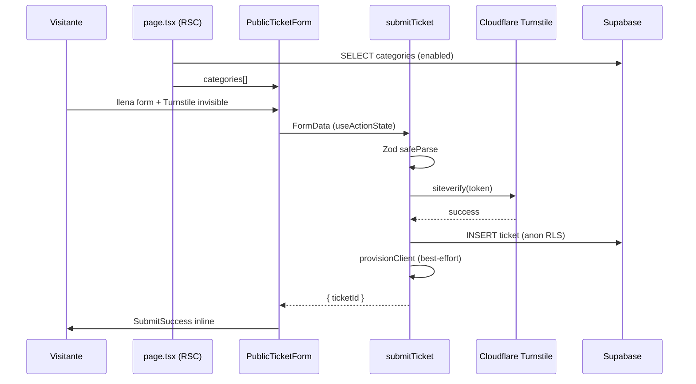

# Fase 4 — `public-form`

**Estado:** Acordado (grill-me)  
**Fecha:** 2026-06-18  
**Depende de:** Fase 3 (`tickets-core`)  
**PRD:** [§14 — Development Phases](./PRD.md#14-development-phases-sdd)

Formulario público de envío de tickets con protección Cloudflare Turnstile. Flujo end-to-end sin adelantar notificaciones por email (fase 6).

---

## 1. Alcance

### Incluido (done de la fase)

- UI del formulario público en `/` (español MX)
- Schema Zod compartido (cliente + server)
- Widget Turnstile invisible + verificación server-side
- `submitTicket` endurecido (sin fallbacks de desarrollo)
- Pantalla de éxito inline en la misma página
- Seed de categorías para dev/CI
- Tests unit/integration + Playwright e2e (happy path)

### Excluido (fases posteriores)

- Emails de confirmación → fase 6 (`notifications`)
- Vista de seguimiento por magic link → fase 8 (`client-tracking`)
- Panel admin de categorías → fase 7 (`admin-panel`)
- Dashboard staff en español (permanece en inglés)

### Cambios en `submitTicket` (eliminar)

- Fallback `"Anonymous"` cuando falta `name`
- Auto-creación de categoría `"Default Category"`
- Insert sin validación Zod ni verificación Turnstile

---

## 2. Decisiones de diseño

| #   | Tema           | Decisión                                                                                           |
| --- | -------------- | -------------------------------------------------------------------------------------------------- |
| 1   | Alcance        | Flujo end-to-end; emails en fase 6                                                                 |
| 2   | Post-envío     | Éxito **inline** en `/`, sin redirect                                                              |
| 3   | Formulario     | **RHF + Zod** en cliente; **`useActionState`** en server con re-validación                         |
| 4   | Turnstile      | Modo **invisible**; test keys de Cloudflare en local; verificación **siempre** activa (sin bypass) |
| 5   | Categorías     | Precarga en **Server Component** → prop al form client                                             |
| 6   | Sin categorías | **Ocultar** formulario; mostrar Card informativo                                                   |
| 7   | Validación     | Schema **conservador** (ver §4)                                                                    |
| 8   | Idioma         | **Español (MX)** — UI pública de esta fase                                                         |
| 9   | Tests          | Unit/integration + **Playwright e2e** happy path                                                   |
| 10  | Seed           | `supabase/seed.sql` con categorías de ejemplo                                                      |
| 11  | Layout         | Header _"Mesa de ayuda"_ + link _"Consultar ticket"_ → `/track/access`                             |
| 12  | Errores        | Por campo (validación) / Turnstile con reset widget / genérico catch-all                           |

---

## 3. Diagrama de flujo



---

## 4. Schema Zod compartido

Archivo propuesto: `lib/schemas/ticket-submit.ts`

```ts
export const ticketSubmitSchema = z.object({
  name: z.string().trim().min(2, "El nombre es obligatorio").max(100),
  email: z.string().trim().email("Correo inválido").max(254),
  subject: z.string().trim().min(3, "El asunto es obligatorio").max(200),
  body: z.string().trim().min(10, "Describe tu problema").max(5000),
  priority: z.enum(["low", "medium", "high", "urgent"]).default("medium"),
  category_id: z.string().uuid("Selecciona una categoría"),
  turnstile_token: z.string().min(1, "Verificación de seguridad requerida"),
});
```

**Prioridad por defecto:** `medium` (select pre-seleccionado en el formulario).

---

## 5. Cloudflare Turnstile

| Entorno        | Site key                                          | Secret key                            |
| -------------- | ------------------------------------------------- | ------------------------------------- |
| Local / CI     | `1x00000000000000000000AA` (test — always passes) | `1x0000000000000000000000000000000AA` |
| Staging / Prod | Keys reales desde Cloudflare Dashboard            | Keys reales                           |

- Librería: `@marsidev/react-turnstile` (ya instalada)
- Modo: `size: "invisible"`, `action: "submit-ticket"`
- Verificación server-side: POST a `https://challenges.cloudflare.com/turnstile/v0/siteverify`
- Helper propuesto: `lib/turnstile/verify.ts`
- **No** usar bypass en dev cuando falten keys — usar test keys oficiales

Documentar test keys en `.env.example`.

---

## 6. Categorías

### Carga

- `app/(public)/page.tsx` (Server Component) consulta Supabase:
  - `categories` con `is_enabled = true`, ordenadas por `name`
- RLS existente: policy `"Public can select enabled categories"` para rol `anon`

### Sin categorías habilitadas

- No renderizar el formulario
- Mostrar componente `EmptyCategoriesMessage` (Card informativo)

### Seed (`supabase/seed.sql`)

```sql
INSERT INTO public.categories (name, is_enabled) VALUES
  ('Soporte técnico', true),
  ('Facturación', true),
  ('General', true)
ON CONFLICT (name) DO NOTHING;
```

Referenciado por `supabase/config.toml` → `[db.seed] sql_paths`.

---

## 7. Layout y metadata

**Route group:** `app/(public)/`

| Elemento  | Valor                                                            |
| --------- | ---------------------------------------------------------------- |
| `lang`    | `es-MX`                                                          |
| `title`   | Enviar ticket · Corp Tickets                                     |
| Header    | _Mesa de ayuda_ + link _Consultar ticket_ → `/track/access`      |
| Contenido | Card centrado con formulario o mensaje de éxito / sin categorías |

---

## 8. Manejo de errores

| Tipo                        | Comportamiento UI                                                            |
| --------------------------- | ---------------------------------------------------------------------------- |
| Validación Zod              | Errores por campo vía RHF                                                    |
| Turnstile inválido/expirado | _"La verificación de seguridad falló. Intenta de nuevo."_ + reset del widget |
| DB / RLS / error inesperado | _"No pudimos enviar tu ticket. Intenta de nuevo."_ (sin detalle técnico)     |

Orden en `submitTicket`: parse Zod → verify Turnstile → insert → `provisionClient` (best-effort, no bloquea éxito).

Respuesta tipada de la action:

```ts
{ error: null, ticketId: string }
| { error: string, code: "turnstile" }
| { error: string, fieldErrors: Record<string, string[]> }
| { error: string } // genérico
```

---

## 9. Copy (es-MX)

| Estado                | Texto                                                                      |
| --------------------- | -------------------------------------------------------------------------- |
| Título del formulario | Enviar ticket de soporte                                                   |
| Éxito                 | Recibimos tu ticket. Te enviaremos un correo con el enlace de seguimiento. |
| Sin categorías        | No hay categorías disponibles por el momento. Intenta más tarde.           |
| Turnstile fallido     | La verificación de seguridad falló. Intenta de nuevo.                      |
| Error genérico        | No pudimos enviar tu ticket. Intenta de nuevo.                             |
| Header                | Mesa de ayuda                                                              |
| Link consultar        | Consultar ticket                                                           |

---

## 10. Archivos planeados

```
lib/schemas/ticket-submit.ts
lib/schemas/ticket-submit.test.ts
lib/turnstile/verify.ts
lib/turnstile/verify.test.ts
components/public/public-ticket-form.tsx
components/public/empty-categories.tsx
components/public/submit-success.tsx
app/(public)/page.tsx
app/(public)/layout.tsx
app/actions/tickets.ts                    (refactor submitTicket)
app/actions/__tests__/tickets.test.ts     (actualizar)
supabase/seed.sql
tests/e2e/public-form/submit.spec.ts
.env.example                              (test keys Turnstile)
```

---

## 11. Tests

| Capa      | Archivo                                 | Qué cubre                                  |
| --------- | --------------------------------------- | ------------------------------------------ |
| Schema    | `lib/schemas/ticket-submit.test.ts`     | Edge cases de validación                   |
| Turnstile | `lib/turnstile/verify.test.ts`          | Mock POST siteverify                       |
| Action    | `app/actions/__tests__/tickets.test.ts` | submitTicket + validación + turnstile      |
| E2E       | `tests/e2e/public-form/submit.spec.ts`  | Happy path: llenar → submit → éxito inline |

E2E usa test keys de Cloudflare; submit real sin bypass.

---

## 12. Skills recomendados

### Instalar antes de implementar

```bash
npx skills add cloudflare/skills@turnstile-spin -g -y
npx skills add ovachiever/droid-tings@react-hook-form-zod -g -y
```

| Skill                                        | Installs | Uso                                        |
| -------------------------------------------- | -------- | ------------------------------------------ |
| `cloudflare/skills@turnstile-spin`           | ~2.7K    | Integración Turnstile (oficial Cloudflare) |
| `ovachiever/droid-tings@react-hook-form-zod` | ~584     | RHF + Zod + shadcn Form                    |

### Ya disponibles en el proyecto

- `shadcn` — componentes Form, Select, Textarea, Card
- `nextjs` — Server Actions, RSC
- `supabase` — RLS anon insert/select
- `verification` — checklist pre-merge
- `tdd` — Vitest + Playwright

---

## 13. Referencias

- [PRD §10 — Public Submission Form](./PRD.md#10-public-submission-form)
- [PRD §12 — Tech Stack (react-hook-form + zod, Turnstile)](./PRD.md#12-tech-stack)
- [Cloudflare Turnstile — Testing](https://developers.cloudflare.com/turnstile/troubleshooting/testing/)
- [Cloudflare Turnstile — Server-side validation](https://developers.cloudflare.com/turnstile/get-started/server-side-validation/)
